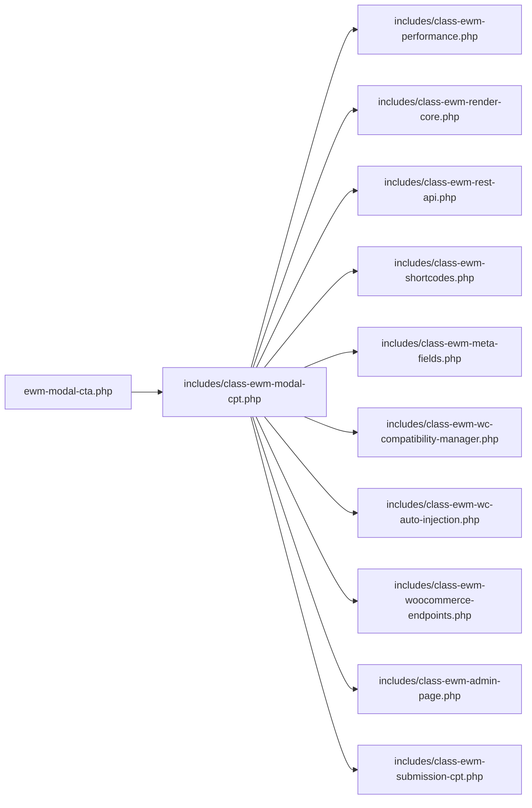

# EWM Modal CTA
# Archivo eliminado por solicitud del líder
Plugin profesional para la gestión avanzada de modales en WordPress, con integración total a WooCommerce, builder visual, performance optimizada y arquitectura modular.

## 🚀 Características principales
- **Custom Post Type** para modales (`ew_modal`)
- **Builder visual** para configuración avanzada
- **Almacenamiento flexible**: JSON o serializado (backend)
- **Shortcodes** y widgets
- **Integración avanzada con WooCommerce**
- **Optimización de performance**: carga condicional de assets, caché, lazy loading
- **Endpoints REST** para integración headless
- **Seguridad**: validación, sanitización y control de permisos

## 📦 Estructura del plugin

```
/ewm-modal-cta
├── ewm-modal-cta.php                # Bootstrap principal
├── includes/
│   ├── class-ewm-modal-cpt.php      # Gestión de modales (CPT)
│   ├── class-ewm-performance.php    # Performance y caché
│   ├── class-ewm-render-core.php    # Renderizado de modales
│   ├── class-ewm-rest-api.php       # Endpoints REST
│   ├── class-ewm-shortcodes.php     # Shortcodes
│   ├── class-ewm-meta-fields.php    # Meta fields flexibles
│   ├── class-ewm-wc-compatibility-manager.php # WooCommerce
│   ├── class-ewm-admin-page.php     # Builder visual
│   ├── class-ewm-submission-cpt.php # Envíos de formularios
│   └── ...
├── assets/                          # CSS y JS
├── docs/                            # Documentación técnica
└── ...
```

## 🛠️ Instalación
1. Sube la carpeta `ewm-modal-cta` a `/wp-content/plugins/`
2. Activa el plugin desde el panel de administración de WordPress
3. Accede a "EWM Modals" en el menú para crear y gestionar modales

## 🧩 Uso básico
- Crea un nuevo modal desde el admin
- Configura los pasos y reglas desde el builder visual
- Usa el shortcode `[ew_modal id="123"]` donde quieras mostrar el modal
- Integra con WooCommerce para mostrar modales en carrito, checkout, etc.

## 🔗 Integraciones
- **WooCommerce**: inyección automática, triggers, reglas avanzadas
- **REST API**: endpoints para headless y apps externas
- **Shortcodes**: inserción en cualquier parte del contenido

## ⚡ Performance
- Carga condicional de assets
- Caché de configuraciones y queries
- Lazy loading de modales
- Optimización de consultas a la base de datos

## 🔒 Seguridad
- Validación y sanitización de entradas
- Nonces en formularios admin
- Control de permisos en endpoints y acciones

## 🏗️ Arquitectura



## 👨‍💻 Desarrollo y extensión
- Código modular y documentado
- Fácil de extender con nuevos hooks y módulos
- Compatible con child themes y plugins personalizados

## 📚 Documentación adicional
- Ver carpeta `/docs` para guías técnicas, integración y seguridad

## 📝 Licencia
GPL v2 o superior
